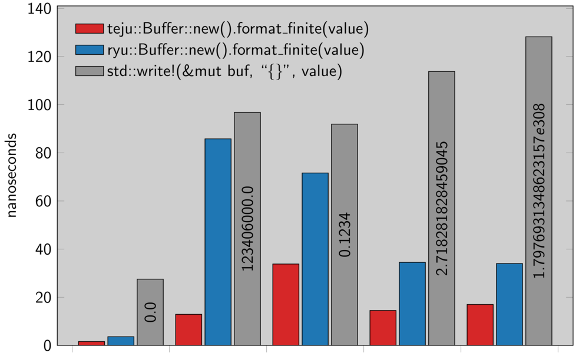

Tejú Jaguá
==========

**🚧 Work in progress 🚧**

Tejú Jaguá is an algorithm for converting floating point values into strings. This crate is an
implementation of this algorithm in Rust.

`teju` is an alternative to the formatting facilities in Rust's `std` library, and is also a
drop-in replacement for [ryu](ryu), another popular crate to format floating point value (since it
implements the same interface).

Compared to `ryu`, it should have the following advantages:

- Faster.

- Can format in decimal and scientific notation.

## Usage

Tejú is very simple to use. `teju::Buffer` provides enough storage for the string, and the `format`
function writes the string to that storage and returns a `&str`.

```rust
assert_eq!(teju::Buffer::new().format(1.234), "1.234")
```

Storage is stack allocated so you don't need to worry about re-using `Buffer`s for efficiency. To
force scientific notation or decimal notation, use `format_exp`/`format_dec`, respectively.

## Performance

Tejú Jaguá is a very fast algorithm. As a ballpark estimate, this crate should be around 1.5–6×
faster than `ryu` and 3–8× faster than `std`/`core`.



These are microbenchmarks so take them with a grain of salt. More comprehensive benchmarks are
included; run them with `cargo bench`.

## Implementation

The core Tejú algorithm and C implementation are all by [Cassio Neri]
(https://scholar.google.co.uk/citations?user=SQCBUmUAAAAJ); for more info refer to
https://github.com/cassioneri/teju_jagua. The algorithms for rendering to string are based on a
two-digit lookup table.

This crate has no (non-dev) dependencies, and can be used in `no_std` contexts.
